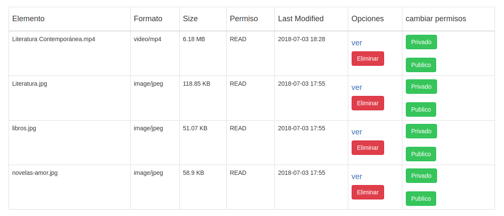

# App_spaces

### Desarrollo
Por medio de una aplicación PHP sencilla, se implementarán los distintos comandos para interactuar con subidas y descargas de archivos a servidores de almacenamiento remoto a traves de la API Spaces de la plataforma web Digital Ocean. 

### Descripción
Se trata de una aplicación que almacena contenidos multimedia de distintos cursos o talleres. Estos talleres estan a cargo de un profesor quien necesita subir material digital para compartir con sus alumnos. La principal ventaja de esta aplicacion web será el poder administrar de manera eficiente la subida y descarga de los distintos formatos y tamaños de archivos. 

### Requerimientos
El cliente web de la aplicación debe autentificarse a través de una API Key con el servicio de almacenamiento.
Dentro de la aplicación, el usuario, al crear un taller debe generar automaticamente una nueva carpeta en el servico de almacenamiento.
En la vista de cada taller debe existir una interfaz de subida de archivos, con un botón y una barra de progreso.
Dentro de la vista de cada taller debe existir una galeria o listado con el contenido de la carpeta.
Cada archivo de la galeria debe mostrar un cuadro de herramientas al ser seleccionado, con las opciones de descarga, copiar url y eliminar.
Los tipos de archivos necesarios son: ```.jpg, .pdf, .mp3, .mp4, .wmv, .mpg, .movie```.
El código debe ser documentado y escrito con la guia de desarrollo de la API de Spaces y la documentación del framework.
Debe existir una versión web online para pruebas.

### Construcción / Modificación

``` bash
# instalación de composer en local
sudo su
curl -sS https://getcomposer.org/installer | php

# instalación de dependencias
php composer.phar install

# permisos
sudo chmod 777 runtime/ web/assets/

- Implementar la base de datos y modificar los parámetros de conexión del archivo app_spaces/config/db.php. 
- Crear un space y almacenar las llaves de conexión en la base de datos.
```

### Imágenes de demostración



